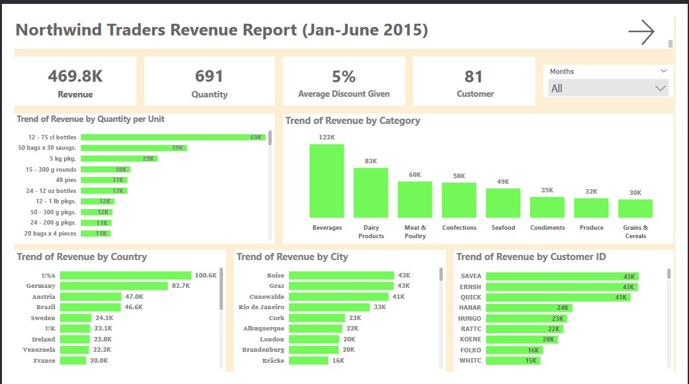
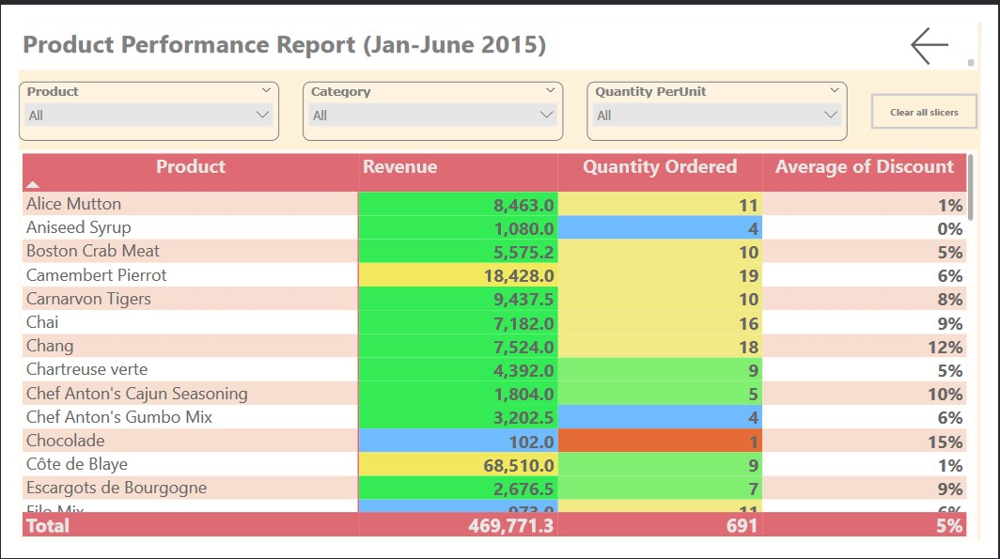

# Northwind-Traders
Northwind Traders Revenue Report (January - June 2015)

## Introduction
This analysis documentation provides insights into the trends and patterns observed in the Northwind Traders sales dataset for the 1st half of 2015. This analysis focuses on revenue trends by category, city, customer ID, country, and quantity per unit. Additionally, it includes a product performance report highlighting key metrics for individual products to make a better decision in the 2nd half of 2015.

## Objective
Northwind Traders, a company known for distributing gourmet food products, wants to make its operations better and decisions smarter in the 2nd half of 2015. To achieve this, the company plans to study its sales data, how customers behave, and how well its products are doing with emphasis on the 1st half of 2015. By doing this, Northwind Traders hopes to find important insights and ways to grow even more.
In their analysis, Northwind Traders wants to look closely at sales trends, how customers buy things, and which products are selling well based on what was achieved in the 1st half of 2015. They believe that by understanding these things better, they can make smarter choices about what to sell and how to sell it. This means they can make sure they have the right products in stock and keep their customers happy.

## Problem Statement
o	What makes customers keep coming back, and how can Northwind Traders use this to get more loyal customers?

o	Are there certain products that are selling faster than others, and how can Northwind Traders make sure they always have enough of these in stock?

o	Do different types of customers buy different things, and how can Northwind Traders use this information to offer products that people want?

## Source
- Northwind Traders data
- Microsoft Excel

## Concept Demonstrated
- Power BI query
-  Power BI
  * KPIs Slicer
  * Filter
  * Quick Measures
  * Page Navigation
  * Visualization
  * Button

## Modelling

The model i s a star schema, there are 5-dimension tables and 1 fact table with a many-to-one relationship

## Visualization
The report comprises of 2 pages:
* Customer Behaviour
* Product Performance

You can interact with the report [here]

##Analysis

Customer Behaviour: 

The revenue dashboard displays a variety of key indicators and analyses, providing an understanding of sales trends across various dimensions during the specified timeframe.

Features:

- KPIs:
  
  * Revenue: This is the overall income generated from sales between January to June
  * Quantity: This indicates the total amount of products or units sold during the reporting period.
  * Customers: This shows the count of unique customers who made purchases within the specified period.
  * Average Discount Given: This denotes the average discount applied to sales transactions.
  * slicer button: This allows to filter data interactively across different visuals and identifying trends within specific months

- Quantity Sold per Unit: This section visualizes the quantity sold per unit for each product category and time period.

-  Revenue by Country: This section exhibits the revenue generated from sales in different countries.

-  Revenue by Category: This section presents the trend of revenue over time for each product category.

-  Revenue by City: This section displays the revenue generated from sales in different cities.

-  Revenue by Customer ID: This section illustrates the revenue generated from individual customers.

Product Performance:

    
This shows how well the products are performing, and which may need improvement or adjustments to drive better results

   

   

 Recommendations And Conclusion

Northwind traders have recorded a very low demand for certain products, such as chocolate, Louisiana Hot Spiced Okro, and Mishi Kobe Niku. It is important to figure out how to sell more of these and reduce their current stock level. Meanwhile, there's a need to increase stock of beverages, dairy product, meat & poultry and confections to meet customer's demand.

To sell more in the second part of the year, we need to start doing more sales promotions and marketing.

countries like Finland, Norway, Mexico, Denmark and Argentina as they remain in the bottom five in the first half of 2025. More attention should be given the listed countries in other to increase the sales in the countries.
Beverages, Dairy products, Meat & Poultry and Confections categories had more purchase in the first half of 2015. The the products should be made more available in the second half of the year as it remains in the high demands from customers.
There was a sharp increase in sales in April with about $134k, January, February and March also had a good sales but the sales suffers a huge decline in the month of May. More promotions and marketing strategies need to be roll out in the second half of the year to increase the sales.
Gifts and recognition should be given to the top customers to reward their loyalty to the business and also customers with low patronage should be encourage  
